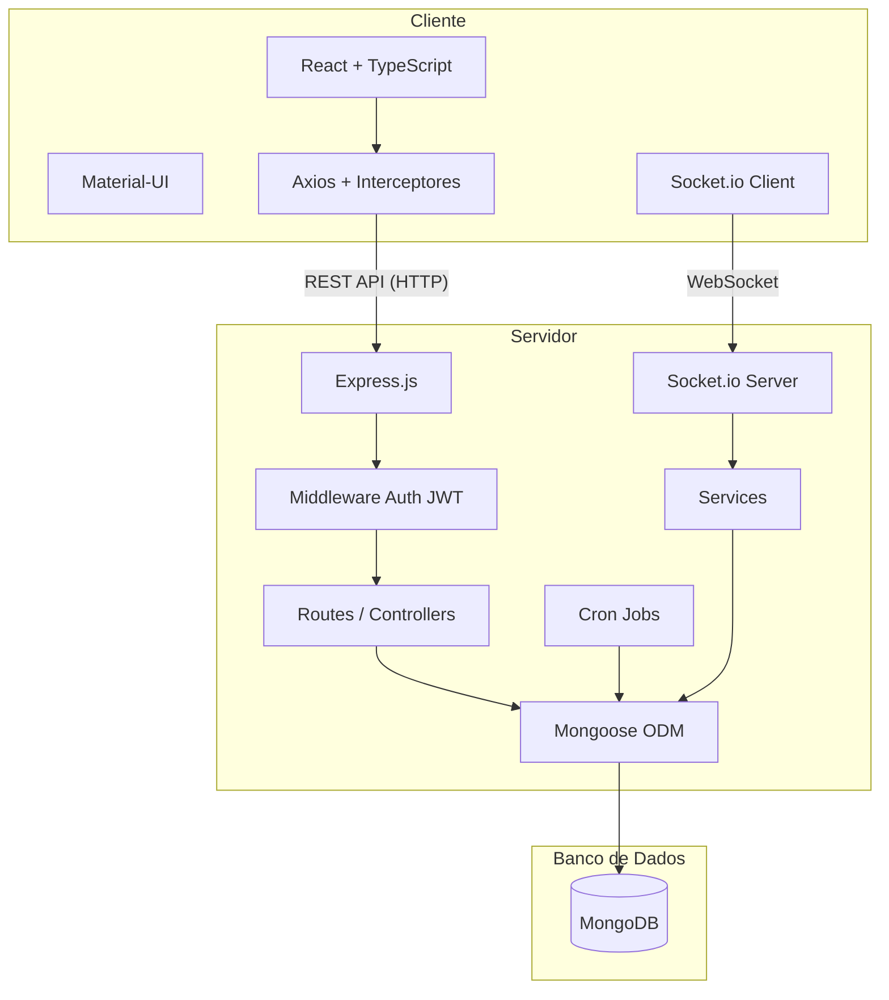
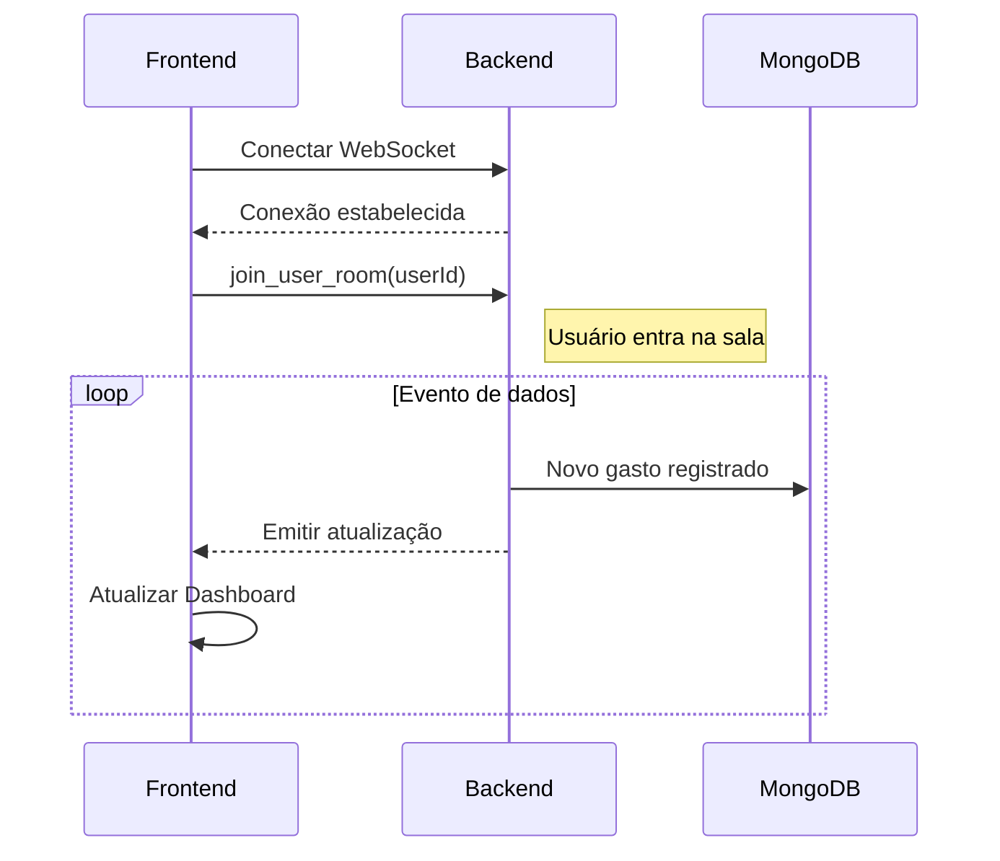
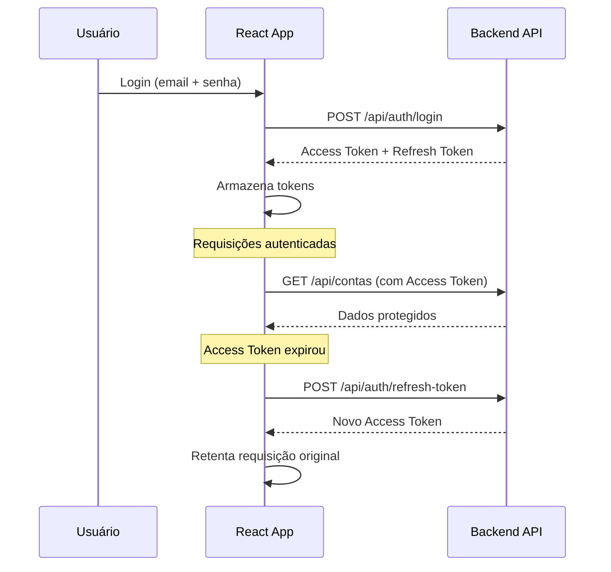
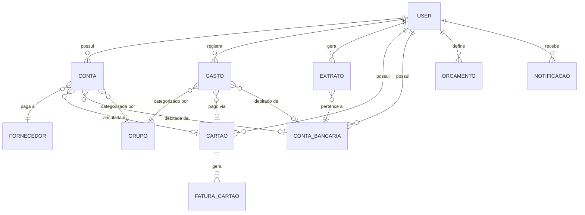

# Arquitetura do Sistema

O Controle Financeiro segue uma arquitetura **cliente-servidor** com comunicação bidirecional via REST e WebSockets.

---

## Visão Geral

---

## Backend

O backend é construído com **Node.js + Express** e segue uma arquitetura em camadas:

### Camadas

| Camada | Diretório | Responsabilidade |
|---|---|---|
| **Rotas** | `routes/` | Definição dos endpoints HTTP e validações |
| **Middleware** | `middleware/` | Autenticação JWT, rate limiting, error handler |
| **Models** | `models/` | Schemas Mongoose (definição do banco de dados) |
| **Services** | `services/` | Lógica de negócio complexa (e-mail, notificações) |
| **Jobs** | `jobs/` | Tarefas agendadas via `node-cron` |
| **Schedulers** | `schedulers/` | Agendador de notificações automáticas |
| **Utils** | `utils/` | Logger (Winston), conexão DB, WebSocket, keep-alive |

### Segurança

- **Helmet** — Headers HTTP de segurança
- **CORS** — Origens permitidas com whitelist configurável
- **Rate Limiting** — Limite global (`1000 req/15min`) e restrito para auth (`100 req/15min`)
- **JWT** — Access Token (curta duração) + Refresh Token (longa duração)
- **bcrypt** — Hash de senhas com salt

### Comunicação em Tempo Real

O servidor utiliza **Socket.io** para comunicação bidirecional:

---

## Frontend

O frontend é uma **SPA (Single Page Application)** construída com React e TypeScript:

### Estrutura

| Diretório | Função |
|---|---|
| `pages/` | Páginas da aplicação (Login, Dashboard, Contas, etc.) |
| `components/` | Componentes reutilizáveis (Layout, Charts, Error Boundary) |
| `context/` | Contextos React para estado global (Auth, Theme) |
| `hooks/` | Custom hooks para lógica compartilhada |
| `types/` | Definições de tipos TypeScript |
| `utils/` | Utilitários (formatação, API client) |

### Fluxo de Autenticação

---

## Banco de Dados

O MongoDB armazena os dados com os seguintes modelos principais:

### Modelos

| Modelo | Coleção | Descrição |
|---|---|---|
| `User` | `users` | Usuários com dados pessoais e configurações |
| `Conta` | `contas` | Contas a pagar/receber com status e parcelamento |
| `Gasto` | `gastos` | Gastos diários com categorização |
| `Extrato` | `extratos` | Movimentações bancárias |
| `Cartao` | `cartaos` | Cartões de crédito |
| `FaturaCartao` | `faturacartaos` | Faturas mensais dos cartões |
| `ContaBancaria` | `contabancarias` | Contas bancárias do usuário |
| `Fornecedor` | `fornecedors` | Fornecedores vinculados às contas |
| `Grupo` | `grupos` | Categorias e subcategorias de despesas |
| `FormaPagamento` | `formapagamentos` | Formas de pagamento disponíveis |
| `Orcamento` | `orcamentos` | Orçamentos mensais por categoria |
| `Notificacao` | `notificacaos` | Notificações do sistema |

---

## Infraestrutura

### Docker Compose

O projeto utiliza Docker Compose com 3 serviços:

| Serviço | Container | Porta | Função |
|---|---|---|---|
| `mongodb` | `cf-mongodb` | 27017 | Banco de dados |
| `backend` | `cf-backend` | 5000 | API REST + WebSocket |
| `frontend` | `cf-frontend` | 3000 | Aplicação React |

### CI/CD (GitHub Actions)

O repositório possui fluxos de integração contínua:

1. **Instala** dependências de backend e frontend
2. **Lint** do backend (`npm run lint`)
3. **Build** do frontend (`npm run build`)
4. Relata falhas antes de qualquer merge na branch `main`

### Deploy

O projeto suporta deploy em:

- **Vercel** — Backend como serverless functions
- **Render** — Backend como serviço long-running
- **Docker** — Deploy containerizado completo
